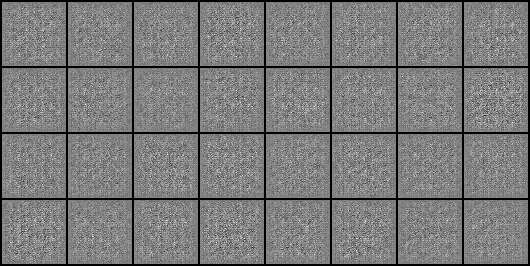
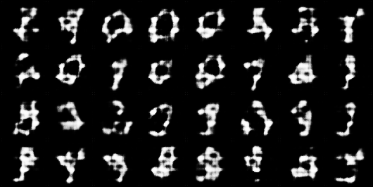
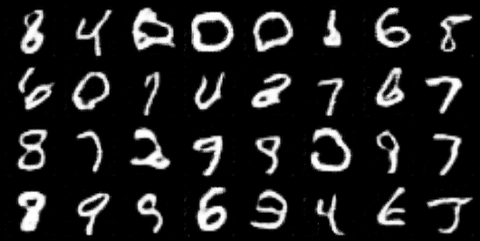

# DCGAN_minist_datasets
DCGANs using minist datasets
<h2>DCGANs model using MNIST datasets </h2> 
this model just generate data doesnot exist in real world  
the data we have trained digits number 
the model is free from CNNs and it make result  
<h3>before training model and it 's  generated images like</h3>  

<h3>in training model and it is generated images like </h3> 
 
<h3>after training model and it 's  generated images like</h3>  
 
notes :  
also there is a tensorboard to see the training  
to see it just write this command in the same folder 
tensorboard --logdir=logs
